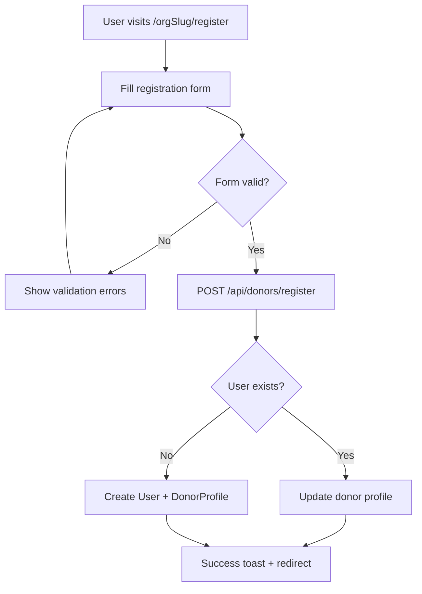
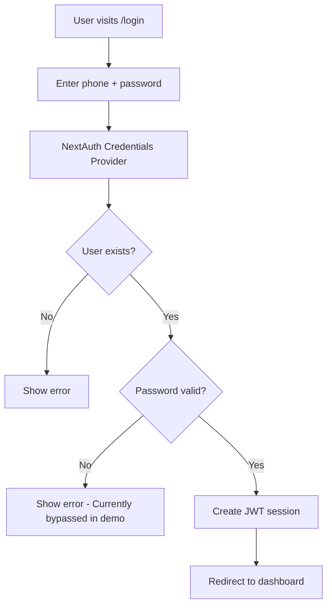

# Project Progress & Feature Documentation 📊

This document tracks the development progress, implemented features, and future roadmap for the Rural Blood Bank platform.

---

## Table of Contents
1. [Current Status](#current-status)
2. [Core Features - Implemented](#core-features---implemented)
3. [Feature Details](#feature-details)
4. [API Reference](#api-reference)
5. [User Flows](#user-flows)
6. [Technical Implementation](#technical-implementation)
7. [Known Limitations](#known-limitations)
8. [Roadmap](#roadmap)
9. [Changelog](#changelog)

---

## Current Status

| Metric | Status |
|--------|--------|
| **Build Status** | ✅ Passing |
| **TypeScript** | ✅ No type errors |
| **Core Features** | ✅ Complete |
| **Authentication** | ✅ Working (demo mode) |
| **Database** | ✅ MongoDB integrated |
| **PWA Support** | ✅ Enabled |
| **Mobile Responsive** | ✅ Yes |

**Last Updated:** January 29, 2026

---

## Core Features - Implemented

### ✅ Multi-Tenant Architecture (100%)
- [x] Organization-scoped URL routing (`/[orgSlug]/...`)
- [x] Organization data model with customizable branding
- [x] Organization context provider for client components
- [x] Dynamic primary color theming
- [x] Per-organization data isolation

### ✅ User Authentication (100%)
- [x] Phone-based login system
- [x] NextAuth.js integration with Credentials provider
- [x] JWT session strategy
- [x] Role-based user model (donor, patient, volunteer, admin, super_admin)
- [x] Protected dashboard routes
- [x] Password hashing (bcrypt)
- [x] OTP/SMS verification

### ✅ Donor Management (100%)
- [x] Donor registration form with validation
- [x] Zod schema validation for donor data
- [x] Age validation (18-65 years)
- [x] Blood group selection (A+, A-, B+, B-, O+, O-, AB+, AB-)
- [x] Location fields (District, Upazila, Village)
- [x] Last donation date tracking
- [x] Availability status
- [x] Verification status (admin-controlled)
- [x] API endpoint for donor registration
- [x] API endpoint for donor verification

### ✅ Donor Discovery (100%)
- [x] Search donors by blood group
- [x] Filter by district
- [x] Filter by upazila (sub-district)
- [x] Display donor cards with key information
- [x] Show verification badge
- [x] Display contact number
- [x] Show last donation date
- [x] Loading states
- [x] Empty state handling

### ✅ Blood Request System (100%)
- [x] Create new blood request form
- [x] Urgency levels (Normal, Urgent, Emergency)
- [x] Required date selection
- [x] Patient information collection
- [x] Location details (District, Upazila)
- [x] Contact number
- [x] Additional notes field
- [x] Request status management (pending, fulfilled, canceled)
- [x] API for creating requests
- [x] API for updating status
- [x] API for listing requests with filters
- [x] Public request listing page

### ✅ Admin Dashboard (100%)
- [x] Dashboard overview page with data visualizations
- [x] Statistics cards (Total Donors, Verified, Pending Requests, Lives Helped)
- [x] Real-time stats fetching from API
- [x] Blood group distribution bar chart
- [x] Request status donut chart
- [x] Fulfillment rate & verification rate progress rings
- [x] Urgency distribution panel (Normal, Urgent, Emergency)
- [x] Location stats (Top Districts, Top Upazilas)
- [x] Recent donors list with verification status
- [x] Recent blood requests list with urgency badges
- [x] Link to donor verification page
- [x] Link to request management page
- [x] Donor management page with verification controls
- [x] Request management page with status updates
- [x] API: GET `/api/org/analytics?orgSlug=X` (org-scoped analytics)
- [x] User management page with search, filtering, role assignment
- [x] Add/Edit/Delete users with role management
- [x] Organization settings page with live preview
- [x] Color picker with presets for branding
- [x] Dashboard sidebar navigation (desktop) and tabs (mobile)
- [x] API: GET/POST `/api/org/users`, GET/PUT/DELETE `/api/org/users/[id]`
- [x] API: GET/PUT `/api/org/settings`

### ✅ Super Admin Dashboard (100%)
- [x] Super admin layout with dark navbar
- [x] Platform-wide statistics with visualizations
- [x] Organizations list with performance metrics per org
- [x] Blood group distribution bar chart (platform-wide)
- [x] Request status donut chart
- [x] Key performance progress rings (Fulfillment, Verified, Available)
- [x] Urgency distribution panel
- [x] Recent 7-day activity banner
- [x] Organization performance table with fulfillment rates
- [x] Create new organization form with validation
- [x] Edit organization with live color preview
- [x] Organization status toggle (active/inactive)
- [x] Delete organization with confirmation
- [x] Search and filter organizations
- [x] API: GET/POST `/api/admin/organizations`
- [x] API: GET/PUT/DELETE `/api/admin/organizations/[id]`
- [x] API: GET `/api/admin/stats`
- [x] API: GET `/api/admin/analytics` (platform-wide analytics)

### ✅ UI Components (100%)
- [x] Button component with variants (default, outline, ghost, secondary)
- [x] Card component (Card, CardHeader, CardTitle, CardContent, CardFooter)
- [x] Input component with label and error support
- [x] Navbar with mobile menu
- [x] Footer with organization info
- [x] Toast notifications (Sonner)
- [x] Loading spinners
- [x] Error states

### ✅ Landing Pages (100%)
- [x] Main platform landing page
- [x] Organization-specific landing page
- [x] Hero sections with CTAs
- [x] Feature highlights
- [x] Statistics display
- [x] How it works section
- [x] Call-to-action sections

### ✅ PWA Support (100%)
- [x] Service worker configuration
- [x] Offline support
- [x] Installable on mobile devices
- [x] Next-PWA integration

---

## Feature Details

### 1. Organization System

The platform supports multiple blood bank organizations, each with:

| Feature | Description |
|---------|-------------|
| **Unique URL Slug** | Each org has a unique URL path (e.g., `/savar-blood-bank`) |
| **Custom Branding** | Primary color, logo, contact info |
| **Isolated Data** | Donors and requests are organization-scoped |
| **Dynamic Theming** | UI adapts to org's primary color |

**Implementation:**
- `Organization` model in MongoDB
- `OrganizationContext` React context for client-side access
- Server-side org lookup in layout using `getOrganizationBySlug()`

### 2. Donor Registration Flow



**Fields Collected:**
- Full Name
- Age (18-65)
- Gender (Male/Female/Other)
- Phone Number
- Blood Group
- District
- Upazila
- Village (optional)
- Last Donation Date (optional)

### 3. Donor Discovery System

**Search Filters:**
- Blood Group (dropdown)
- District (text input)
- Upazila (text input)

**Displayed Information:**
- Donor name
- Blood group badge
- Location (Upazila, District)
- Village (if available)
- Verification status
- Phone number
- Last donation date

**API Query:**
```
GET /api/donors?orgSlug=X&bloodGroup=A+&district=Dhaka&upazila=Savar
```

### 4. Blood Request System

**Urgency Levels:**
| Level | Description |
|-------|-------------|
| `normal` | Standard priority, can wait a few days |
| `urgent` | High priority, needed soon |
| `emergency` | Critical, needed immediately |

**Request Status:**
| Status | Description |
|--------|-------------|
| `pending` | Request is active, looking for donors |
| `fulfilled` | Blood has been arranged |
| `canceled` | Request was canceled |

### 5. Dashboard Statistics

The dashboard fetches real-time statistics:

```javascript
{
  donorsCount: 250,        // Total registered donors
  livesHelped: 1200,       // Calculated: (completedRequests * 3) + (donorCount / 2)
  activeRequests: 12,      // Pending requests count
  villagesCovered: 45      // Unique villages from donor profiles
}
```

### 6. Authentication Flow



**Current Demo Mode:**
- Any registered phone number works
- Password is bypassed (accepts anything in demo)
- For production: Integrate bcrypt or OTP/SMS

---

## API Reference

### Donors API

#### GET /api/donors
List donors for an organization.

**Query Parameters:**
| Parameter | Type | Required | Description |
|-----------|------|----------|-------------|
| `orgSlug` | string | Yes | Organization URL slug |
| `bloodGroup` | string | No | Filter by blood group |
| `district` | string | No | Filter by district (case-insensitive) |
| `upazila` | string | No | Filter by upazila (case-insensitive) |

**Response:** Array of DonorProfile objects with populated user data

#### POST /api/donors/register
Register a new donor.

**Body:**
```json
{
  "name": "string",
  "phone": "string",
  "age": "number",
  "gender": "Male|Female|Other",
  "bloodGroup": "string",
  "district": "string",
  "upazila": "string",
  "village": "string?",
  "lastDonationDate": "string?",
  "orgSlug": "string"
}
```

#### POST /api/donors/verify
Verify or unverify a donor (admin only).

**Body:**
```json
{
  "donorId": "string",
  "isVerified": "boolean"
}
```

### Requests API

#### GET /api/requests
List blood requests for an organization.

**Query Parameters:**
| Parameter | Type | Required | Description |
|-----------|------|----------|-------------|
| `orgSlug` | string | Yes | Organization URL slug |
| `urgency` | string | No | Filter by urgency level |
| `status` | string | No | Filter by status (default: pending) |

#### POST /api/requests/new
Create a new blood request.

**Body:**
```json
{
  "patientName": "string",
  "bloodGroup": "string",
  "location": "string",
  "district": "string",
  "upazila": "string",
  "urgency": "normal|urgent|emergency",
  "requiredDate": "string (ISO date)",
  "contactNumber": "string",
  "additionalNotes": "string?",
  "orgSlug": "string"
}
```

#### POST /api/requests/status
Update request status.

**Body:**
```json
{
  "requestId": "string",
  "status": "pending|fulfilled|canceled"
}
```

### Organization API

#### GET /api/org/stats
Get organization statistics.

**Query Parameters:**
| Parameter | Type | Required | Description |
|-----------|------|----------|-------------|
| `orgSlug` | string | Yes | Organization URL slug |

**Response:**
```json
{
  "donorsCount": "number|string",
  "livesHelped": "number|string",
  "activeRequests": "number|string",
  "villagesCovered": "number"
}
```

---

## User Flows

### 1. Donor Registration
1. User visits organization landing page
2. Clicks "Become a Donor" button
3. Fills out registration form
4. Submits form → API creates User + DonorProfile
5. Success notification → Redirected to donor discovery page

### 2. Finding Blood Donors
1. User visits `/orgSlug/donors`
2. Optionally applies filters (blood group, location)
3. Views list of available donors
4. Clicks phone number to contact donor

### 3. Posting Blood Request
1. User visits `/orgSlug/requests/new`
2. Fills patient information form
3. Selects urgency level and required date
4. Submits request → API creates BloodRequest
5. Request appears in public listing and dashboard

### 4. Managing Requests (Admin)
1. Admin logs in
2. Navigates to Dashboard → Manage Requests
3. Views all requests with filters
4. Updates request status (Mark as Fulfilled/Canceled)

### 5. Verifying Donors (Admin)
1. Admin logs in
2. Navigates to Dashboard → Verify Donors
3. Views list of unverified donors
4. Clicks Verify to approve donor

---

## Technical Implementation

### State Management
- **Server State:** MongoDB via Mongoose
- **Client State:** React useState/useEffect
- **Auth State:** NextAuth.js session
- **Organization Context:** React Context API

### Data Fetching
- **Server Components:** Direct MongoDB queries
- **Client Components:** Fetch API with useEffect
- **Forms:** React Hook Form with Zod validation

### Styling Approach
- **Framework:** Tailwind CSS 4.x
- **Component Library:** Custom UI components
- **Theming:** CSS-in-JS style for dynamic colors
- **Responsive:** Mobile-first design

### File Naming Conventions
- **Pages:** `page.tsx`
- **Layouts:** `layout.tsx`
- **API Routes:** `route.ts`
- **Components:** PascalCase (e.g., `Navbar.tsx`)
- **Utilities:** camelCase (e.g., `orgUtils.ts`)

---

## Known Limitations

### Authentication
1. **No Password Hashing**: Demo mode accepts any password
2. **No OTP/SMS**: Phone verification not implemented
3. **No Password Reset**: Recovery flow not available

### Data
1. **No Pagination**: Large datasets may cause performance issues
2. **No Caching**: API responses not cached
3. **Villages Count Static**: Currently hardcoded to 45

### Security
1. **No Rate Limiting**: APIs are not rate-limited
2. **No CSRF Protection**: Additional security measures needed
3. **Admin Routes Not Protected**: Dashboard accessible without proper role check

### UX
1. **No Real-Time Updates**: Dashboard doesn't auto-refresh
2. **No Push Notifications**: For new blood requests
3. **No Location Auto-Complete**: Districts/upazilas are text fields

---

## Roadmap

### Phase 1: Security & Auth (Priority: High)
- [ ] Implement bcrypt password hashing
- [ ] Add OTP/SMS verification via Bangladesh gateways
- [ ] Role-based route protection middleware
- [ ] Rate limiting for API endpoints
- [ ] CSRF protection

### Phase 2: Enhanced Features (Priority: Medium)
- [ ] Real-time notifications (Socket.io or SSE)
- [ ] Push notifications for new requests
- [ ] Email notifications
- [ ] Donor availability scheduler
- [ ] Donation history tracking
- [ ] Blood type compatibility suggestions

### Phase 3: Admin Improvements (Priority: Medium)
- [x] User management page ✅ COMPLETE
- [x] Organization settings page ✅ COMPLETE
- [x] Bulk donor verification ✅ COMPLETE
- [x] Export data (CSV/JSON reports) ✅ COMPLETE
- [x] Analytics dashboard with charts ✅ COMPLETE

### Phase 4: UX Enhancements (Priority: Low)
- [x] District/Upazila dropdown with autocomplete ✅ COMPLETE
- [ ] Location-based donor sorting (nearest first)
- [x] Advanced search filters ✅ COMPLETE
- [x] Dark mode support ✅ COMPLETE
- [ ] Multi-language support (Bengali)

### Phase 5: Scaling (Priority: Low)
- [ ] API response caching (Redis)
- [ ] Pagination for large datasets
- [ ] CDN for static assets
- [ ] Database indexing optimization
- [ ] Kubernetes deployment config

---

## Changelog

### v0.1.0 - Initial Release
**Date:** January 2026

**Features:**
- ✅ Multi-tenant organization support
- ✅ Donor registration and discovery
- ✅ Blood request system with urgency levels
- ✅ Admin dashboard with statistics
- ✅ Phone-based authentication (demo mode)
- ✅ PWA support for offline access
- ✅ Responsive design for mobile devices
- ✅ Organization-scoped routing

**Tech Stack:**
- Next.js 16.1.5
- TypeScript 5.x
- MongoDB/Mongoose 9.x
- NextAuth.js 4.x
- Tailwind CSS 4.x
- React Hook Form + Zod

---

## Development Notes

### Running Locally
```bash
# Install dependencies
npm install

# Set up environment variables
cp .env.example .env.local
# Edit .env.local with your MongoDB URI

# Seed database
npx tsx scripts/seed.ts

# Start dev server
npm run dev
```

### Testing Endpoints
```bash
# Get organization stats
curl "http://localhost:3000/api/org/stats?orgSlug=savar-blood-bank"

# List donors
curl "http://localhost:3000/api/donors?orgSlug=savar-blood-bank&bloodGroup=O%2B"

# List requests
curl "http://localhost:3000/api/requests?orgSlug=savar-blood-bank&status=pending"
```

### Common Issues

| Issue | Solution |
|-------|----------|
| MongoDB connection error | Check MONGODB_URI in .env.local |
| Auth not working | Verify NEXTAUTH_SECRET is set |
| Organization not found | Run seed script to create test orgs |
| Build errors | Run `npm install` to update dependencies |

---

*This document is maintained as part of the Rural Blood Bank project. Last updated: January 29, 2026*
